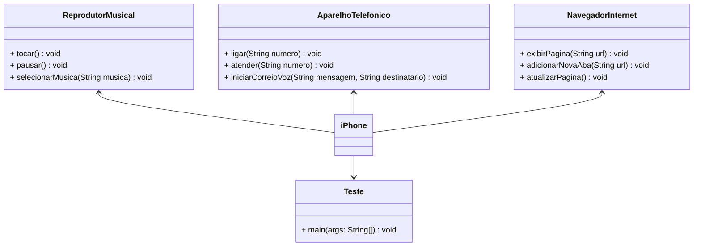

# POO - Desafio 📚

## Modelagem e Diagramação de um Componente iPhone 📱

Este repositório contém a solução para o desafio proposto na trilha Java Básico da DIO. O desafio consistia em modelar e diagramar a representação UML do componente iPhone, abrangendo suas funcionalidades como Reprodutor Musical, Aparelho Telefônico e Navegador na Internet.

### Funcionalidades Modeladas 🎵📞🌐
1. **Reprodutor Musical**
   - Métodos: `tocar()`, `pausar()`, `selecionarMusica(String musica)`
2. **Aparelho Telefônico**
   - Métodos: `ligar(String numero)`, `atender(String numero)`, `iniciarCorreioVoz(String mensagem, String destinatario)`
3. **Navegador na Internet**
   - Métodos: `exibirPagina(String url)`, `adicionarNovaAba(String url)`, `atualizarPagina()`

## Diagrama UML (Mermaid) 🖥️
- Utilize uma ferramenta UML: [Mermaid](https://mermaid.js.org/), uma alternativa open-source e compatível com arquivos Markdown como este.

## Implementação em Java ☕
As classes e interfaces foram implementadas em Java conforme o diagrama UML acima.

## Instruções 📝
1. Clone este repositório.
2. Navegue até o diretório do projeto.
3. Compile e execute os arquivos `.java` para testar as funcionalidades implementadas.

